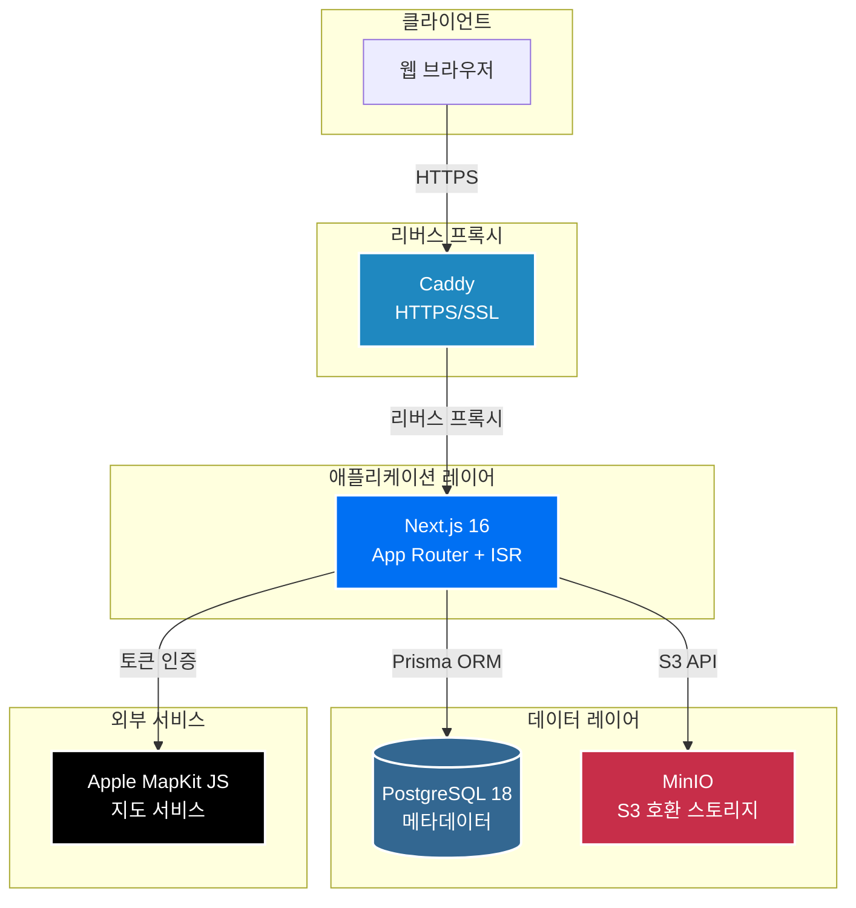
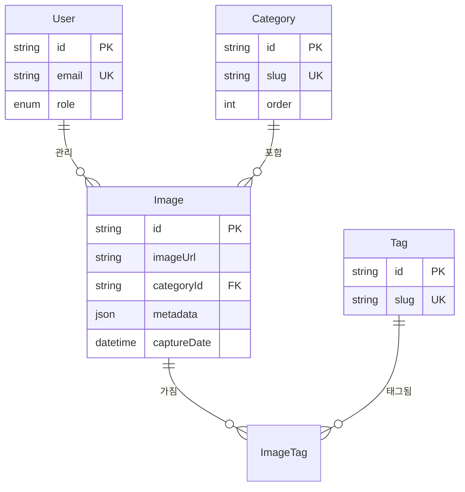

# gallery.jihun.io

https://gallery.jihun.io

사진 찍는 개발자 jihun의 사진 갤러리입니다.

## 주요 기능

- **자동 EXIF 추출**: 카메라 정보, 촬영 설정, GPS 좌표 자동 파싱
- **Apple MapKit 통합**: 촬영 위치를 지도에 표시
- **스마트 관리**: 카테고리/태그 기반 사진 분류 및 썸네일 자동 생성
- **모달 기반 뷰**: Next.js Parallel Routes로 부드러운 사진 탐색
- **역할 기반 인증**: NextAuth.js 기반 보안 시스템

## 시스템 아키텍처

## 배포 파이프라인

**배포 특징**: 멀티 플랫폼 Docker 빌드 (amd64/arm64) · Next.js Standalone 모드 · 자동 헬스 체크

## 데이터 모델

## 기술 스택

- **Frontend**: Next.js 16 · TypeScript · Tailwind CSS 4
- **Backend**: Node.js 20 · PostgreSQL 18 · Prisma · NextAuth.js
- **Infra**: Docker · MinIO · Caddy · GitHub Actions

## 기술적 특징

- **Next.js App Router**: Parallel Routes & Intercepting Routes를 활용한 모달 라우팅
- **ISR 최적화**: `unstable_cache`로 Prisma 쿼리 캐싱 및 On-Demand Revalidation
- **EXIF 처리**: exifr 라이브러리로 메타데이터를 JSON으로 저장 및 쿼리
- **이미지 최적화**: Sharp 기반 썸네일 생성 + MinIO S3 호환 스토리지
- **프로덕션 배포**: Docker 멀티 스테이지 빌드 + Caddy 리버스 프록시

---

## 문제 해결 사례

### 1. 스토리지 마이그레이션: Cloudflare R2 → MinIO

초기에는 Cloudflare R2를 사용했으나, 데이터베이스와 애플리케이션은 셀프 호스팅 서버에 위치하고 이미지만 외부 CDN에 존재하여 레이턴시가 발생했습니다. 이를 해결하기 위해 스토리지를 서버 내 컨테이너로 구축하기로 결정했고, S3 호환 API를 제공하는 MinIO를 선택하여 기존 코드 수정을 최소화했습니다.

Next.js API Route를 통해 MinIO를 프록시하도록 구현한 결과, 이미지 로딩 속도가 개선되었고 모든 데이터를 단일 서버에서 관리하게 되어 백업과 복원 프로세스가 간소화되었습니다.

---

### 2. 리버스 프록시 전환: Cloudflared → Caddy

로컬 환경에서는 메인 페이지 응답 시간이 200-250ms로 측정되었으나, 프로덕션 환경에서는 1.5-2초가 소요되었습니다. 동일한 데이터베이스와 스토리지를 사용하는 환경에서 비교 테스트한 결과, Cloudflared 터널이 약 1.5초의 오버헤드를 발생시키는 것으로 확인되었습니다.

이를 해결하기 위해 Caddy 리버스 프록시로 전환했습니다. docker-compose에 Caddy 컨테이너를 추가하고 Let's Encrypt 자동 인증서 발급을 설정한 결과, 응답 시간이 150-250ms로 개선되어 약 87%의 성능 향상을 달성했습니다.

---

### 3. 쿼리 캐싱 도입: unstable_cache 적용

서비스를 운영하면서 매 요청마다 Prisma를 통한 데이터베이스 쿼리가 실행되어 서버 부하가 증가하고 불필요한 응답 지연이 발생하는 것을 발견했습니다. 특히 메인 페이지와 카테고리 목록처럼 자주 조회되지만 변경이 드문 데이터의 경우 캐싱이 효과적일 것으로 판단했습니다.

Next.js의 `unstable_cache`를 활용하여 메인, 카테고리, 사진 상세 페이지의 Prisma 쿼리 결과를 캐싱하고 10분 재검증 주기를 설정했습니다. 또한 On-Demand Revalidation을 구현하여 새로운 사진을 업로드하거나 데이터를 수정할 때 즉시 캐시를 무효화하도록 했습니다.

그 결과 동일 데이터 재요청 시 데이터베이스 접근 없이 캐시된 결과를 반환하게 되어 서버 부하가 감소하고 응답 속도가 개선되었습니다.

