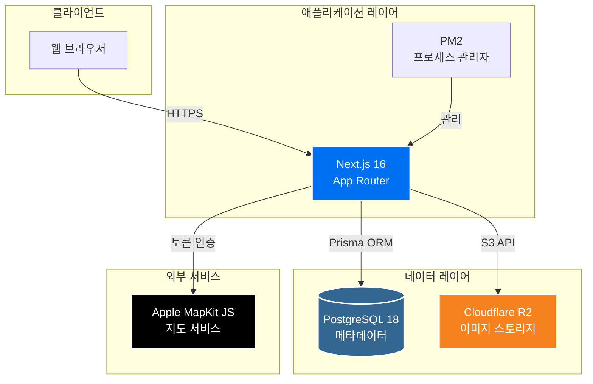
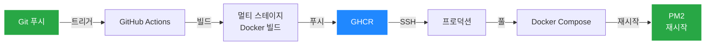
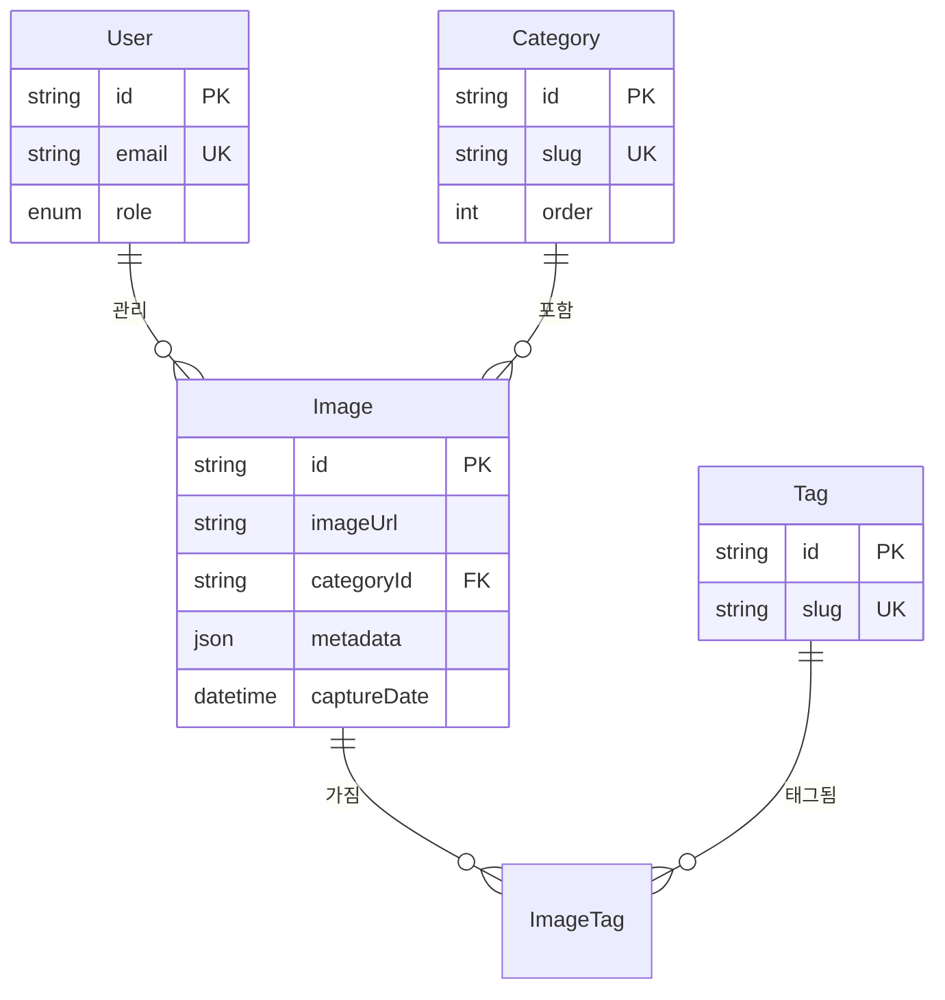

# gallery.jihun.io

https://gallery.jihun.io

사진 찍는 개발자 jihun의 사진 갤러리입니다.

## 주요 기능

- **자동 EXIF 추출**: 카메라 정보, 촬영 설정, GPS 좌표 자동 파싱
- **Apple MapKit 통합**: 촬영 위치를 지도에 표시
- **스마트 관리**: 카테고리/태그 기반 사진 분류 및 썸네일 자동 생성
- **모달 기반 뷰**: Next.js Parallel Routes로 부드러운 사진 탐색
- **역할 기반 인증**: NextAuth.js 기반 보안 시스템

## 시스템 아키텍처

## 배포 파이프라인

**배포 특징**: 멀티 플랫폼 Docker 빌드 (amd64/arm64) · PM2 프로세스 관리 · 자동 헬스 체크

## 데이터 모델

## 기술 스택

- **Frontend**: Next.js 16 · TypeScript · Tailwind CSS 4
- **Backend**: Node.js 20 · PostgreSQL 18 · Prisma · NextAuth.js
- **Infra**: Docker · PM2 · Cloudflare R2 · GitHub Actions

## 기술적 특징

- **Next.js App Router**: Parallel Routes & Intercepting Routes를 활용한 모달 라우팅
- **EXIF 처리**: exifr 라이브러리로 메타데이터를 JSON으로 저장 및 쿼리
- **이미지 최적화**: Sharp 기반 썸네일 생성 + R2 CDN 배포
- **프로덕션 배포**: Docker 멀티 스테이지 빌드 + PM2 프로세스 관리
